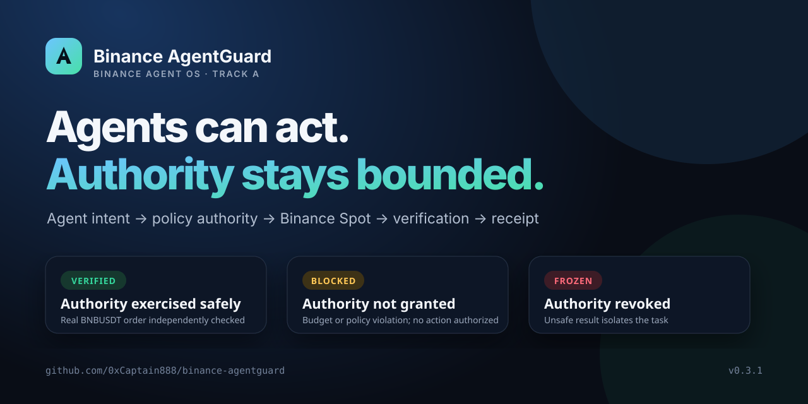

# Binance AgentGuard

[](https://github.com/0xCaptain888/binance-agentguard/actions/workflows/ci.yml) [](https://github.com/0xCaptain888/binance-agentguard/actions/workflows/codeql.yml) [](https://github.com/0xCaptain888/binance-agentguard/releases/latest) [](https://0xcaptain888.github.io/binance-agentguard/)



Binance AgentGuard is the control plane that lets an AI Agent act on Binance without giving it unchecked authority: it turns a natural-language goal into a bounded Spot intent, authorizes only policy-compliant actions, independently verifies the result, and seals every outcome in a tamper-evident receipt.

> **Not a kill switch:** AgentGuard grants bounded authority, verifies how that authority was used, and produces evidence another system can audit.

**[Open the public Judge Console](https://0xcaptain888.github.io/binance-agentguard/)** · **[Use the submission kit](docs/submission-kit.md)** · **[Watch the 3-minute script](docs/demo-script.md)** · **[Read the Agent architecture](docs/agent-loop.md)**

## Why this is Binance-specific

The project is built around Binance Agent OS/Agentic MCP, not a generic exchange adapter:

- the Agent operates through an isolated Agentic account context;
- Binance MCP provides the authenticated market-data and Spot tool surface;
- AgentGuard applies organization-level policy before the tool call;
- Binance order/trade records are queried independently after execution.

The commercial wedge is accountable Agent execution: teams can let Agents operate on Binance while retaining budgets, approved markets, human confirmation, incident isolation, and audit-ready receipts.

## The judge path

```text
Natural-language goal → AI planner → Binance MCP quote
→ deterministic policy gate → user confirmation
→ Binance Spot → independent verifier
→ VERIFIED / BLOCKED / FROZEN + evidence hash
```

The AI planner may propose an intent, but it cannot authorize execution or certify its own output. The deterministic policy engine and independent verifier remain authoritative. AgentGuard is not a “stop the bot” switch; it is the accountable action layer between Agent intent and Binance execution.

## 60-second reproduction

```bash
npm install
npm run demo:agent
npm run judge:check
```

The simulator never moves funds. `judge:check` validates the TypeScript, nine policy/verification tests, three Agent states, both public evidence bundles, and required Judge Console signals.

The public console demonstrates the same flow without a wallet, API key, OAuth token, or account. It clearly labels simulator evidence.

The Judge Console also includes an adjustable policy sandbox: judges can change
the allowed symbol, per-action/daily budget, prior spend, slippage limit, and
confirmation flag, then inspect a live verification matrix showing expected,
observed, and PASS/FAIL/N/A for each control. Receipt hashes and the public
Binance evidence bundle can be recomputed in-browser with Web Crypto; no
credentials or account connection are required.

## Evidence layers

1. **Real execution:** one previously authorized Binance Spot BNBUSDT market BUY, order `12512896470`, FILLED for `0.007 BNB / 4.81047 USDT`, independently queried and hash-bound. [Open evidence](evidence/public/2026-09-02-bnbusdt-buy-001.json)
2. **Live read-only Agent:** an actual Codex planner generated an intent and observed a live Binance MCP quote; AgentGuard returned `BLOCKED` because confirmation was absent. [Open evidence](evidence/public/2026-09-02-ai-live-readonly-001.json)
3. **Reproducible simulation:** the public console and `npm run demo:agent` show `VERIFIED`, `BLOCKED`, and `FROZEN` deterministically.

Binance Spot order IDs are authenticated exchange records, not public blockchain transaction hashes. Run `npm run verify:live-evidence` and `npm run verify:ai-live-evidence` to recompute the evidence hashes without credentials.

## Optional live read

```bash
npm run live:run -- --read-only
npm run agent:live
```

Both paths read Binance data only and fail closed without explicit confirmation. Credentials stay inside the local authenticated MCP session and are never stored in this repository. Live write mode requires two separate explicit opt-ins and is not needed for judging.

## Security and scope

This is a hackathon reference implementation, not audited production trading software. No credentials, private keys, or API keys are committed. See [`SECURITY.md`](SECURITY.md), [`docs/live-runner.md`](docs/live-runner.md), and [`docs/binance-agent-os.md`](docs/binance-agent-os.md).

## Relationship to the original project

This is the focused Binance A-track application. The broader control-plane research remains in [`0xCaptain888/agent-control-plane`](https://github.com/0xCaptain888/agent-control-plane) and is not required to run this submission.

## License

MIT — see [`LICENSE`](LICENSE).
