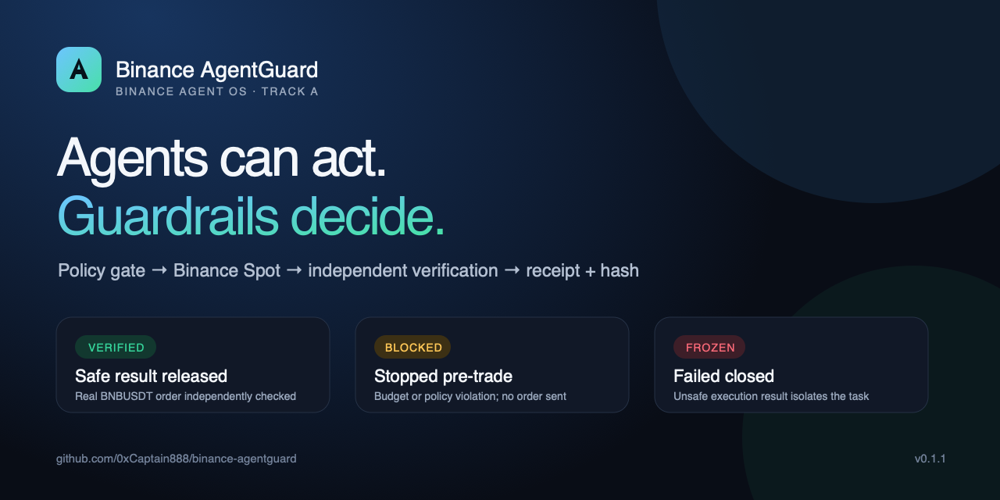

# Binance AgentGuard

[](https://github.com/0xCaptain888/binance-agentguard/actions/workflows/ci.yml)
[](https://github.com/0xCaptain888/binance-agentguard/actions/workflows/codeql.yml)
[](https://github.com/0xCaptain888/binance-agentguard/releases/latest)
[](https://0xcaptain888.github.io/binance-agentguard/)



Policy-gated execution for a Binance AI Agent: the agent converts a natural-language goal into a Spot intent, but AgentGuard only permits actions inside an explicit budget, symbol, market and slippage policy. Every permitted action is independently checked after execution and produces a tamper-evident receipt.

**Live judge demo:** [0xcaptain888.github.io/binance-agentguard](https://0xcaptain888.github.io/binance-agentguard/)

## The judge path

```text
Natural-language user goal
        ↓
AI Agent planner
        ↓
Binance Agent OS / Agentic MCP quote
        ↓
Binance AgentGuard policy gate
        ↓
user confirmation
        ↓
Binance Spot execution
        ↓
independent order verification
        ↓
VERIFIED / BLOCKED / FROZEN + evidence hash
```

The demo uses one bounded scenario: a BNBUSDT Spot action with a 5 USDT per-action limit and 50 bps maximum slippage. It intentionally shows all three outcomes:

- `VERIFIED`: the order is filled and every post-execution check passes.
- `BLOCKED`: the request exceeds policy, so no order is submitted.
- `FROZEN`: execution returns an unsafe result, so the AgentGuard circuit breaker freezes the task.

The Agent path is also available as a deterministic CLI demonstration:

```bash
npm run demo:agent
```

It turns natural-language goals into structured intents, observes a quote,
applies the same policy core, and emits the same receipt states. The public
Judge Console mirrors this flow in the browser without credentials.

The key separation is deliberate: the AI planner may propose an intent, but it
cannot authorize execution or certify its own output. The deterministic policy
engine and independent verifier remain authoritative. See
[`docs/agent-loop.md`](docs/agent-loop.md) for the architecture and trust
boundaries.

## Run in under five minutes

Requirements: Node.js >= 20.18.

```bash
npm install
npm run demo:agent
npm run judge:check
```

The simulator is deterministic and does not move funds. It is the reproducible judge path. The live adapter in `src/binance-agentic.ts` is a credential-free protocol boundary: connect it to an authenticated Binance Agent OS/Agentic session only after explicitly authorizing the account and scopes.

The optional command below wraps that boundary behind the included `scripts/binance-codex-bridge.mjs`, which reuses the local Codex OAuth MCP session without copying credentials:

```bash
npm run live:run -- --read-only
```

It reads the Agentic Spot account and `BNBUSDT` quote but cannot place an order. See [`docs/live-runner.md`](docs/live-runner.md). Write mode requires two explicit opt-ins and is never needed for the deterministic judge path.

If the judge already has Codex CLI and Binance MCP authenticated locally, the
optional command below uses an actual model for goal planning and then runs the
same read-only fail-closed path:

```bash
npm run agent:live
```

It must end `BLOCKED` with `user_confirmation_required`; it does not submit an
order.

## Binance integration boundary

Binance's public Agent Native documentation describes the Agentic MCP endpoint and an isolated Agentic sub-account. The live transport is intentionally injected rather than storing API keys in this repository. Effective account permissions must still be checked in Binance before any live write; this repository does not grant or store withdrawal credentials. See [`docs/binance-agent-os.md`](docs/binance-agent-os.md).

## Evidence model

Each run hashes the intent, policy, quote, order and verification result into `evidenceHash`. A receipt records the state, policy hash and all verification checks. `FROZEN` is an AgentGuard safety state: it disables further actions for the task; it does not claim that Binance itself freezes an account.

### Real Binance Spot evidence

The repository includes one redacted live test receipt: [`evidence/public/2026-09-02-bnbusdt-buy-001.json`](evidence/public/2026-09-02-bnbusdt-buy-001.json). It records a `5 USDT` BNBUSDT market buy submitted through Binance MCP, independently verified with `spot.allOrders` and `spot.myTrades`, and includes the reproducible evidence hash. Run `npm run verify:live-evidence` to recompute the hash and validate the required fields. Binance Spot order IDs are authenticated exchange records rather than public blockchain transaction hashes.

## Relationship to the original project

This is the focused Binance A-track application. The broader control-plane research remains in [`0xCaptain888/agent-control-plane`](https://github.com/0xCaptain888/agent-control-plane); it is not required to run this judge path.

## Security notes

- No credentials, private keys or API keys are committed.
- The first live trial should use an isolated Agentic sub-account and the smallest amount required by the event.
- The demo requests Spot data and uses a Spot order only; effective account permissions must be verified in Binance at runtime.
- Never present simulator receipts as real Binance trades; live receipts must include a Binance order ID and independently queried order status.
- Review [`SECURITY.md`](SECURITY.md) before adapting the explicit live-write path.

## License

MIT — see [`LICENSE`](LICENSE).
